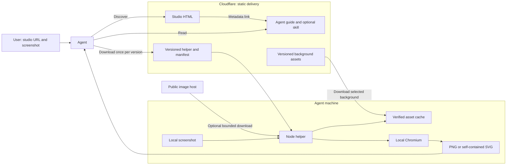
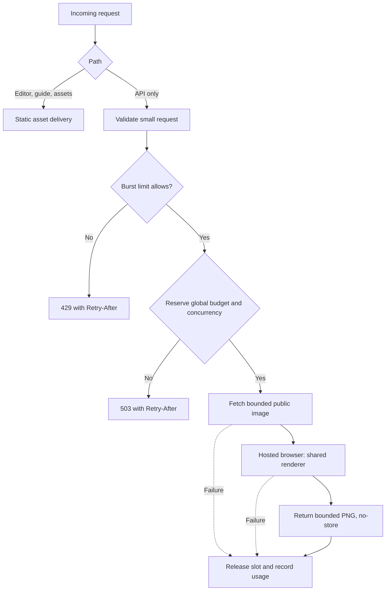

# Agent-friendly Screenshot Studio: implementation proposal

Status: recommended static workflow implemented on `feature/agent-friendly-studio`;
the hosted API remains a proposal.
Date: 2026-09-11.
Public entry point: [Screenshot Studio](https://nitk.me/ss/).

Implementation notes: the user's subsequent implementation request selected the
recommended local-helper scope. Release URLs use a semantic version plus content
fingerprint; the optional skill also has a revalidating stable download alias.
Chromium startup and rendering each have a 30-second deadline. The cache's 100 MiB
limit is an eviction target for sequential helper use, not coordinated accounting
across concurrent processes. Local release validation and screenshots are reproducible
with `npm run validate:agent`; see the README. Continued online availability of older
releases requires retaining their generated assets in subsequent deployments.

## 1. Recommendation and decision still needed

Keep Cloudflare responsible for static delivery. Publish machine-readable instructions
and a downloadable, versioned helper that renders on the agent's machine using the
same composition code as the editor. Add a small **Use with an agent** panel for people.

The original discussion distinguished these URL workflows:

| Workflow | Proposed support |
| --- | --- |
| Give an agent the studio URL and an existing screenshot | Recommended first release: discover instructions, run helper, return image |
| Give the helper a direct image URL | Recommended first release: download and render on the agent's machine |
| Send an HTTP request to the studio and receive image bytes | Optional hosted API; requires a separate implementation and resource budget |
| Give the service a webpage URL to capture and style | Separate future scope; requires webpage navigation and screenshot capture |

Local rendering does **not** satisfy a requirement for an HTTP-only rendering service.
The implemented release follows the local-rendering recommendation. HTTP-only image
generation or webpage capture would require a separate scope decision.

## 2. Current implementation

The app is Vite + React + TypeScript, deployed as Workers Static Assets without a
Worker script entry point. Production assets are packaged beneath `/ss/`.

- [wrangler.jsonc](../wrangler.jsonc) declares static assets only.
- [prepare-worker-assets.mjs](../scripts/prepare-worker-assets.mjs) moves build output
  under `/ss/`, retaining Cloudflare control files at the asset root.
- [svgRenderer.ts](../src/lib/svgRenderer.ts) composes the screenshot, background,
  rounded corners, padding, and shadow into SVG.
- [backgroundAssets.ts](../src/lib/backgroundAssets.ts) loads and embeds backgrounds
  using browser APIs and an in-memory cache.
- [Index.tsx](../src/pages/Index.tsx) currently owns SVG-to-PNG conversion.
- [ImageLoader.tsx](../src/components/ImageLoader.tsx) accepts PNG/JPEG up to 10 MiB.
- [index.html](../index.html) has metadata and a React mounting element, but no agent guide.

The existing [agent_instructions.md](agent_instructions.md) is a historical build brief
describing a different product and stack. It is not the architecture for this work.

## 3. Recommended architecture



Cloudflare receives requests for public documentation and release assets. Screenshot
bytes, composition, and generated files stay on the agent's machine. Remote image
hosts receive the agent's download request when image-URL input is used.

Prerequisites: Node.js 22.12+ and the helper's pinned Playwright/Chromium environment.
An agent without a shell can use its browser tools to operate the editor if it can
upload files and retrieve downloads. An HTTP-only agent cannot render with this design.

### Shared renderer

Extract a pure composition function that takes validated image dimensions, image data,
and an explicit embedded background. It must not read browser globals, Vite environment
variables, local storage, or a mutable asset cache.

Keep browser loading and PNG conversion in a separate adapter. Both the editor and
the helper's local browser call that adapter and the shared composition function.
Build the helper's browser module from the same sources as the editor; do not maintain
a copied renderer or automate screenshots of the editor UI for final output.

Preserve current geometry: screenshot width is 80% of the composed width before
integer rounding, equal padding on every side, 24 px corner radius, and the existing
sRGB shadow. Native export preserves source scale. The existing 4K mode explicitly
resizes the long side to 3840 px and may upscale.

## 4. Discovery without visible instructions in the editor

Publish these proposed static routes beneath the studio's existing path prefix:

| Route | Purpose | Cache policy |
| --- | --- | --- |
| `/ss/llms.txt` | Short description, capabilities, canonical guide link, prerequisites | Revalidate |
| `/ss/agents/guide.md` | Complete input, output, setup, limits, and error instructions | Revalidate |
| `/ss/agents/manifest.json` | Current release, asset URLs, SHA-256 hashes, supported contract version | Revalidate |
| `/ss/agents/releases/<version>/helper.zip` | Helper source/bundle, package manifest, lockfile, usage instructions | Immutable |
| `/ss/agents/releases/<version>/SKILL.md` | Optional skill for agents that support skill installation | Immutable |
| `/ss/agents/assets/<hash>.png` | Backgrounds addressed by content hash | Immutable |

Add a descriptive HTML `<link rel="alternate" type="text/markdown">` pointing to
the guide and a short HTML comment explaining its purpose. An HTTP `Link` header can
repeat that pointer through static asset header configuration. Serve the same HTML
to everyone; do not introduce user-agent detection or dynamic Markdown negotiation.

These are discovery hints, not a guarantee that every bot will follow them. Some
readers strip comments and metadata. The visible panel must also contain an ordinary
guide link so rendered-page readers have a fallback. Keep substantive instructions
in the guide; do not hide paragraphs with off-screen CSS or burden screen readers.

`llms.txt` is a convention, not universal automatic discovery. Keep it beneath `/ss/`;
the domain root may belong to another app. A future root-level pointer requires
coordination with that app. `robots.txt` is crawler policy, not an instruction manual.

The guide must explain what to do, supported capabilities, and how to return the
artifact. It must not instruct an agent to ignore its own permissions or silently
install dependencies. The optional skill is a convenience wrapper around the same
versioned contract, not a second implementation or a prerequisite for using the tool.

## 5. Human-facing entry point

Add **Use with an agent** as a secondary action in the editor. It opens a compact
panel with:

1. A sentence explaining that the agent styles an existing screenshot locally.
2. A **Copy prompt** action.
3. A guide link and optional **Download skill** action, with agent-specific installation
   guidance only for integrations actually tested.
4. A short prerequisite note: the agent needs local execution or browser automation.

Suggested prompt:

> Use https://nitk.me/ss/ to style the attached screenshot with the light background.
> Follow its agent guide and return the finished PNG.

The panel must support keyboard opening/closing, Escape, focus restoration, and
accessible action labels. Copy failures should leave selectable prompt text available.
Keep installation details inside the panel and guide rather than in the main composer.

## 6. Helper contract

The names below define a proposed interface; the helper does not exist yet.

```text
node render.mjs --input ./screenshot.png --background light --output ./styled.png
node render.mjs --url https://example.com/screenshot.png --background dark --output ./styled.svg
node render.mjs --input ./screenshot.png --size 4k --output ./styled.png
```

| Argument | Contract |
| --- | --- |
| `--input` / `--url` | Exactly one; local PNG/JPEG or public HTTPS URL returning PNG/JPEG |
| `--background` | `light` or `dark`; default `light` |
| `--output` | Required local destination; `.png` or `.svg` determines format |
| `--size` | `native` by default; `4k` for PNG only |
| `--force` | Explicit permission to replace an existing destination |
| `--offline` | Require installed runtime and cached release assets; reject URL input |

Use a release archive with a pinned package lock rather than requiring publication to
an npm registry. Document explicit dependency and browser installation steps. Reuse
the installed helper for subsequent images; rendering must never silently install
or update executable dependencies. Playwright is a helper/development dependency;
it must not enter the website's client bundle.

Stdout contains one JSON result; progress goes to stderr. Successful output includes
`ok`, `output`, `format`, `width`, `height`, `bytes`, and `rendererVersion`. Failures
include `ok: false`, a stable `code`, and a human-readable `message`, with a nonzero
exit code. Never include source image bytes or signed URL query strings in logs.

Error codes: `INVALID_ARGUMENT`, `UNSUPPORTED_IMAGE`, `INPUT_TOO_LARGE`,
`PIXEL_LIMIT_EXCEEDED`, `FETCH_FAILED`, `FETCH_TIMEOUT`, `ASSET_UNAVAILABLE`,
`ASSET_INTEGRITY_FAILED`, `RUNTIME_MISSING`, `RENDER_FAILED`, `OUTPUT_TOO_LARGE`,
and `OUTPUT_EXISTS`.

### Execution flow

```mermaid
sequenceDiagram
    actor User
    participant Agent
    participant Site as Static studio assets
    participant Helper as Local helper
    participant Host as Optional image host
    participant Browser as Local Chromium
    User->>Agent: Studio URL + screenshot or image URL
    Agent->>Site: Fetch HTML and linked guide
    Site-->>Agent: Instructions and release manifest
    Agent->>Helper: Run installed, pinned helper
    Helper->>Helper: Validate arguments and destination
    opt Image URL input
        Helper->>Host: Bounded HTTPS download
        Host-->>Helper: PNG/JPEG bytes
    end
    Helper->>Helper: Validate signatures, byte size, dimensions
    opt Selected background absent from verified cache
        Helper->>Site: Fetch versioned background
        Site-->>Helper: Background bytes
        Helper->>Helper: Verify hash and cache
    end
    Helper->>Browser: Embedded inputs + render options
    Browser->>Browser: Compose shared SVG; rasterize for PNG
    Browser-->>Helper: Output bytes and dimensions
    Helper->>Helper: Enforce output limit; write atomically
    Helper-->>Agent: JSON result and local artifact
    Agent-->>User: Finished image
```

Fetch remote inputs with Node rather than browser cross-origin fetches. Embed the
validated bytes before rendering. Use a controlled local browser document and block
its network requests: rendering should not navigate arbitrary websites or fetch
external resources from SVG. Close the browser in `finally`, including failures.

## 7. Bandwidth and resource controls

### Cloudflare constraints

Cloudflare currently documents free, unlimited Static Asset requests. Worker execution
on Free has 100,000 requests/day and 10 ms CPU per invocation. These are separate
constraints; bandwidth throttling is not needed merely to preserve a static site's
Worker execution allowance. [Static Asset billing](https://developers.cloudflare.com/workers/static-assets/billing-and-limitations/),
[Worker limits](https://developers.cloudflare.com/workers/platform/limits/).

Keep the recommended release assets-only. Do not enable `run_worker_first` globally
or add a Worker just to count static downloads. Cache policies reduce repeat transfer;
they do not enforce an absolute bandwidth ceiling or guarantee availability under
every possible outage or attack.

### Proposed helper limits

These are starting values to validate with representative screenshots, not existing
application behavior. Apply them to the helper first; changing editor input limits
requires separate product consideration.

| Resource | Starting limit / behavior |
| --- | --- |
| Source file | 10 MiB, checked for local files and while streaming downloads |
| Source dimensions | At most 8192 px on either side and 16 million pixels total |
| Composed output | At most 24 million pixels; validate before allocating canvas |
| Encoded output | At most 32 MiB; reject rather than silently reduce quality |
| Remote input | Public HTTPS, default port, no embedded credentials |
| Redirects | At most 3, revalidate every target |
| Download deadline | 15 seconds total including redirects and body transfer |
| Render deadline | 30 seconds; terminate the local browser on timeout |
| Concurrency | One render at a time per helper process |
| Retries | At most 2 retries for transient public asset download failures; exponential backoff |
| Cache | Selected background only; 100 MiB local cap with least-recently-used eviction |

Reject private, loopback, link-local, reserved, and metadata-address destinations.
Check IPv4 and IPv6, including mapped addresses, on every redirect. DNS validation
must apply to the actual connection, not just a preliminary lookup; otherwise rebinding
can bypass it. Prefer a maintained implementation for address classification and
connection control rather than a few hostname regular expressions. Users can provide
local files directly when they need to style private screenshots.

Validate PNG/JPEG signatures and dimensions before browser decoding, then verify
decoded dimensions. Reject SVG and HTML input regardless of filename. A `Content-Length`
header is advisory: enforce actual streamed bytes. Cancel downloads immediately at
the limit. Remove temporary files on failure and avoid partial output destinations.

Store backgrounds by content hash and verify before use. Cache only public release
assets, never source screenshots or outputs. After installation and cache warmup,
local-file rendering makes no network requests; upgrades are an explicit setup action.
Checksums detect corruption and version mismatches but are not independent proof of
publisher identity when delivered from the same origin as the files.

Use `Cache-Control: public, max-age=31536000, immutable` only for genuinely versioned
assets. Guides, manifests, and HTML should revalidate. Emit immutable background
assets once per hash so the editor and helper can share URLs without duplicate
downloads. Do not mark today's stable-name backgrounds immutable without versioning.

## 8. Optional hosted HTTP API

Implement this only if returning image bytes from an HTTP request is required. A
separate API Worker/route isolates application routing; it does not create a separate
account-wide Free quota. Keep editor and documentation requests on static asset delivery.

Proposed contract: `POST /ss/api/v1/render` with JSON containing `imageUrl`,
`background`, and `size`. Return PNG bytes with `Content-Type: image/png` and
`Cache-Control: no-store`. Prefer POST so signed source URLs are not placed in the
API request URL. Do not log request bodies. Publish an OpenAPI description only
if this API is implemented.



A plain Free Worker is not an appropriate place to assume browser-equivalent PNG
rasterization fits into 10 ms CPU. Prototype the complete request path, including
input transfer and encoding, before committing to a hosted design.

Cloudflare Browser Run currently allows 10 browser minutes/day, 3 concurrent browser
sessions, and one new browser instance every 20 seconds on Free. Quick Actions have
their own request pacing. The proposed API must accommodate startup pacing as well
as total duration; per-client throttling alone is insufficient.
[Browser Run limits](https://developers.cloudflare.com/browser-run/limits/).

If this branch proceeds, prototype the following controls:

- A coordinated budget service, such as a Durable Object whose current Free-plan
  eligibility and quotas are verified before implementation. Atomically reserve a
  bounded duration allowance before launching a browser; account for startup and
  teardown, reconcile actual usage, and fail closed if accounting is unavailable.
- An initial maximum of one active render globally, enforced startup spacing, and
  a conservative 5-minute/day application budget within the documented 10-minute
  account allowance. Other applications may consume that allowance too.
- A 10-second rendering deadline, bounded source transfer, no persistent job queue,
  and a kill switch. Adjust proposed dimensions and byte limits after measuring
  the actual hosted path; local helper limits are not proof of hosted feasibility.
- Burst throttling before expensive work, with shared-IP fairness documented.
  Anonymous access is simplest but easier to exhaust; access keys are an optional
  later product decision, not a hidden prerequisite.
- Redacted aggregate metrics for requests, rejected work, browser duration, bytes,
  and failures. No screenshots or source URLs in telemetry.

Cloudflare's rate-limit bindings are local to each location and eventually consistent.
They cannot implement a strict global daily budget; an in-memory counter or a naive
KV read-modify-write counter cannot provide atomic reservation either.
[Rate-limit semantics](https://developers.cloudflare.com/workers/runtime-apis/bindings/rate-limit/).

Even a throttled API request consumes an invocation when it reaches Worker code.
Application limits protect expensive work but cannot guarantee preservation of the
account request quota under distributed abuse. Keeping static routes outside Worker
execution protects the editor from that specific API failure mode.

Return structured errors: 400 invalid arguments, 413 excessive size, 415 unsupported
input, 422 invalid image/dimensions, 429 client throttling, 502 upstream failure,
503 service budget or capacity exhausted, and 504 timeout. Include `Retry-After`
when a meaningful retry time is known. The guide must distinguish retryable failures
from permanent input errors and cap retries.

Do not cache generated images publicly by default: signed URLs and screenshots may
be sensitive, and a source URL can change its contents. Result storage or deduplication
requires a separately defined retention and privacy policy.

## 9. Implementation sequence

### Phase 1 — Shared rendering and local helper

- Extract the pure renderer into the reusable utilities area and keep the existing
  browser-facing module as an adapter while callers migrate.
- Extract reusable browser PNG conversion from the page component.
- Add the helper entry point, argument contract, bounded downloading, asset cache,
  structured results, and controlled local browser runtime.
- Add a build target for the versioned helper archive and manifest. Pin the helper's
  Playwright dependency and lockfile; document installation explicitly.
- Make background hashing and the browser module part of the same production build
  so guide, helper, renderer version, and assets cannot drift independently.

### Phase 2 — Agent discovery and user instructions

- Add the static guide, discovery index, and optional skill generated from the same
  contract/version metadata.
- Add HTML metadata and static response link headers, keeping rendered instructions
  inside the opt-in panel.
- Add the accessible **Use with an agent** panel and copyable prompt.
- Update the README with supported agent capabilities, setup, limits, privacy behavior,
  and the distinction between local rendering and a hosted API.

### Phase 3 — Packaging, checks, and release

- Preserve `/ss/` packaging and root-level Cloudflare control-file placement.
- Ensure Markdown/JSON/archive routes return the right content types and cache headers.
- Test under Wrangler preview, not only Vite, to catch production path errors.
- Exercise the helper from a fresh temporary directory using a built release archive.
- Complete the acceptance checks below before publishing a release.

The hosted API is a separate phase only after the URL workflow decision and a successful
resource-budget prototype. Do not make the static release depend on API infrastructure.

## 10. Validation and acceptance criteria

| Area | Required evidence |
| --- | --- |
| Shared renderer | Existing geometry preserved; both backgrounds; embedded images; no unintended network references in exports |
| Image quality | Use the root `test.png` fixture for manual checks; compare native editor/helper PNG pixels in the same pinned Chromium; inspect shadow edges and text |
| Output modes | Native PNG, 4K PNG, self-contained SVG, and transparent PNG input render correctly; unsupported combinations fail clearly |
| Helper input | File and image-URL success; invalid type, truncated data, byte/pixel overflow, redirects, private addresses, DNS rebinding defense, timeout |
| Output handling | Existing destination protection, atomic writes, encoded-size limit, browser cleanup on success/failure |
| Cache | Corrupt asset rejected; selected background fetched once; warmed local-file and offline runs produce no network traffic |
| Discovery | Raw HTML exposes guide pointer without JavaScript; guide URLs return Markdown rather than an HTML fallback; rendered readers can follow the panel's ordinary link |
| User interface | Desktop/mobile panel, keyboard operation, Escape, focus restoration, working copy fallback, downloadable guide/skill |
| Hosting | Built static routes work beneath `/ss/`; no Worker entry point or global worker-first routing added for the recommended release |
| Release consistency | Every manifest URL resolves; hashes match; helper and editor identify the same renderer release |

Run lint, typecheck, the existing test suite, and the production build when implementing
the feature. Add focused tests for the new contract and limits; the current documentation-only
change does not require application test execution.

Visual comparisons should use a pinned browser and decoded pixels rather than PNG
file-byte equality. Establish a narrow tolerance only where browser rasterization
requires it, with explicit checks for geometry and native-resolution screenshot text.

For the optional API, additionally prove budget reservation is atomic, concurrent
requests cannot overbook capacity, browser startup pacing is respected, timeouts clean
up sessions, and exhausted API quotas do not route editor traffic through failed code.

## 11. Rollout and rollback

Publish complete release assets before updating the manifest and guide pointers, or
deploy them atomically in the same static build. Retain the previously advertised
release so installed helpers and cached guides continue to work. Never overwrite
content served with an immutable URL.

Before release, agree on a retention window for old helper versions and backgrounds;
do not promise indefinite support. Define unsupported-version errors and upgrade
instructions before removing a published release.

Rollback by restoring the previous static build and guide/manifest pointers. Installed
helpers with complete cached assets continue to render locally. A future hosted API
must have an independent disable switch and must not be required by the editor.

## 12. Future scope decisions

1. Is local execution acceptable, or must an HTTP-only caller receive image bytes?
2. Does URL input mean an existing image, or must the service capture webpages?
3. Which agent environments should be explicitly tested for the first release?

Default recommendation: local helper, existing PNG/JPEG screenshots, PNG/SVG output,
light/dark backgrounds, static discovery, and an optional skill. No webpage capture,
accounts, hosted rendering, or result storage in that first release.
